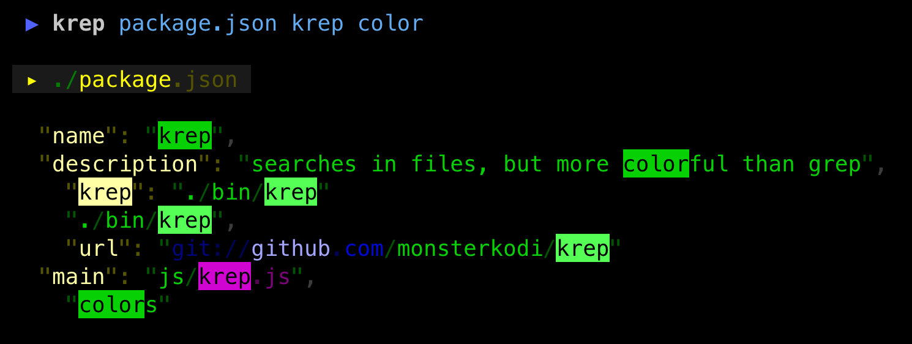
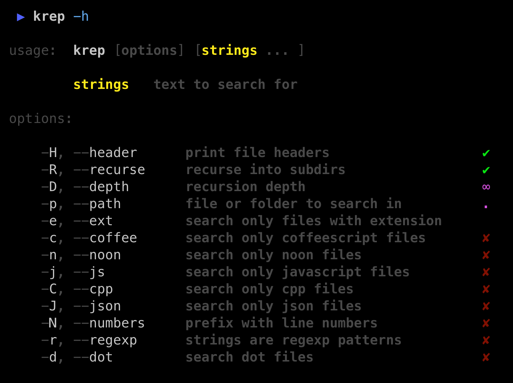

Search for text in files. Similar to `grep` or `ag` but *way* more **colorful** 😋





```sh
npm install -g krep

krep string    # search recursively in the current directory for 'string'
    
krep string .. # same as above, but in the parent directory

krep .. string # dito

krep two words # searches for 'two' and 'words'

krep file      # prints the whole file
```


[![npm package][npm-image]][npm-url] 
[![downloads][downloads-image]][downloads-url] 
[![Dependencies Status][david-image]][david-url]

[npm-image]:https://img.shields.io/npm/v/krep.svg
[npm-url]:http://npmjs.org/package/krep
[david-image]:https://david-dm.org/monsterkodi/krep/status.svg
[david-url]:https://david-dm.org/monsterkodi/krep
[downloads-image]:https://img.shields.io/npm/dm/krep.svg
[downloads-url]:http://npmjs.org/package/krep

